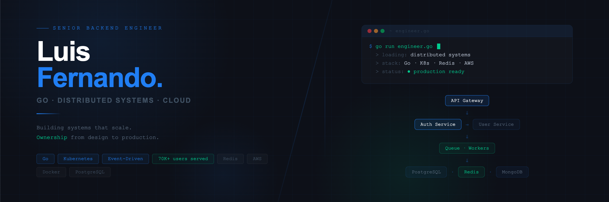

# Hi, I'm Luis Fernando Cifuentes 👋

**Senior Backend Engineer** · Go · Distributed Systems · Event-Driven Architecture

> Building high-performance distributed systems with focus on scalability, concurrency and production resilience.
> Currently leading backend architecture at [X-Grow AI](https://github.com/lfcifuentes) · Open to Senior/Lead roles.

---

## 🚀 About me

- 🔧 **+8 years** building distributed systems and high-performance APIs in **Go**
- ⚡ Specialized in **event-driven architectures**, async processing with workers & queues
- 🏗️ Track record of **full ownership**: from design to production, including redesigning systems with critical flaws
- 📍 Cali, Colombia · Remote-first

**Key impact:**
- Rebuilt an authentication system from scratch → **70K+ users across 5 platforms, zero incidents post-launch**
- **80% response time improvement** migrating services to Go + FastAPI
- Centralized admin platform managing **28K maintenance records + 34K investigation records** with background notifications

---

## 🛠️ Stack

<table>
  <tr>
    <td align="center" width="140">
      <strong>Core</strong>  
      
      
      
    </td>
    <td align="center" width="140">
      <strong>Cloud & DevOps</strong>  
      
      
      
    </td>
    <td align="center" width="140">
      <strong>Databases</strong>  
      
      
      
    </td>
    <td align="center" width="140">
      <strong>Other</strong>  
      
      
      
    </td>
  </tr>
</table>

---

## 📦 Featured projects

| Project | Description | Stack |
|---|---|---|
| **Auth Manager** | Authentication & access control system serving 70K+ users across 5 platforms. Rebuilt from scratch with full ownership. Zero incidents post-launch. | Go · Redis · SQL Server · DDD · Docker |
| **Centralized Admin Platform** | Unified admin panel managing 28K maintenance records + 34K investigation records with background notifications. Eliminated manual flat-file loading. | Go · Redis · SQL Server · Docker |
| **NomadOS** | Online learning platform with 8K registered users and ~2K active memberships. Workflow automation + cloud integrations. | Go · Laravel · Node.js · AWS · PostgreSQL |
| **Borrox** | Fintech platform for financing and document management with automated digital signature flows. | Laravel · MySQL |

---

## 📬 Contact

&nbsp;

&nbsp;

&nbsp;

---

<picture>
  <source media="(prefers-color-scheme: dark)" srcset="https://raw.githubusercontent.com/lfcifuentes/lfcifuentes/output/pacman-contribution-graph-dark.svg">
  <source media="(prefers-color-scheme: light)" srcset="https://raw.githubusercontent.com/lfcifuentes/lfcifuentes/output/pacman-contribution-graph.svg">
  
</picture>
